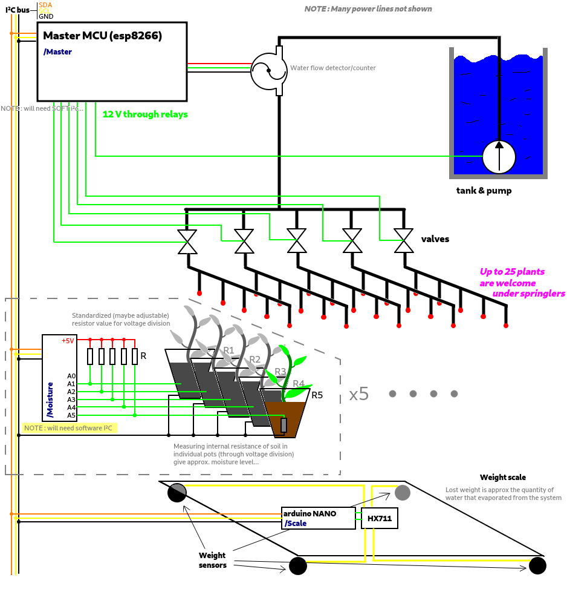

# AutoWatS - Automatic Watering Sytem

## Project Rationale

Use ESP32 to control actionners (pumps, valves) of an automatic watering sytem,
using some sensor to gather information about the environement (soil humidity,
weight of pots, ...)

## Hardware Setup Summary

See the following diagram of the system :

PLEASE NOTE it is slightly old and then outdate, but the main ideas are standing.

Between the main, clear water tank and the valves, I added a mixer bowl (5L), 3 peristaltic pumps along with diluted but still concentrated fertilizer 1.5L feeders (1 fertilizer type per pump).

That means I have another pump + flow counter from the mix bowl to the valves.

A few other difference :
- the humidity sensors will be different (but still addressed through an I²C bus),
- Max 4x4 grid (4 valves) in my setup is largely enough (what matters anyway from system spec pov is # of line, # of row does not really matter).
